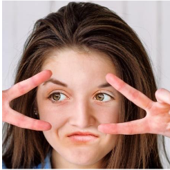
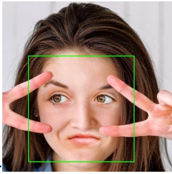

# facedetection
## Face-detection, demonstration using OpenCV in under 50 lines of C++ code

> This is not a face "recognition" program !

- Takes static images as input and gives static image as output.
> .jpg and .png tested 

- Ex. input : 
- Ex. output : 

## Requirements

- Windows C++ package on Visual Studio 15.0.0 or later, g++ or other variant of the standard C++ compiler implementation
- OpenCV 2.0/3.0 (3.0 might differ in implementation, please check documentation provided) 
- Software : Any Operating System that supports OpenCV 2.0 libraries and dependencies, and Environment variables configured to support OpenCV library calls
- Hardware : As long as the system can run OpenCV without problems the program will execute with ease !
- Updating the path variable to correct directories of OpenCV installation

> 4k images or larger size iamges take larger time to process (greater than 5 seconds)

## References

1. https://docs.opencv.org/3.4/d7/dfc/group__highgui.html
2. https://docs.opencv.org/master/d7/da8/tutorial_table_of_content_imgproc.html
3. https://docs.opencv.org/master/d2/d64/tutorial_table_of_content_objdetect.html
4. https://docs.opencv.org/3.4/d2/d99/tutorial_js_face_detection.html
5. https://docs.opencv.org/master/d4/da8/group__imgcodecs.html#ga288b8b3da0892bd651fce07b3bbd3a56
6. https://docs.opencv.org/master/d4/da8/group__imgcodecs.html#gabbc7ef1aa2edfaa87772f1202d67e0ce
7. https://www.geeksforgeeks.org/python-opencv-cv2-imwrite-method/
8. https://en.wikipedia.org/wiki/Haar-like_feature
